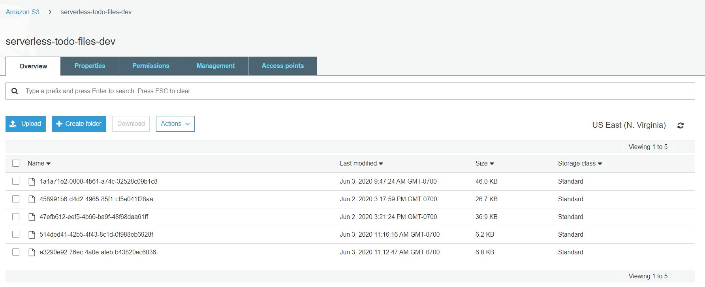
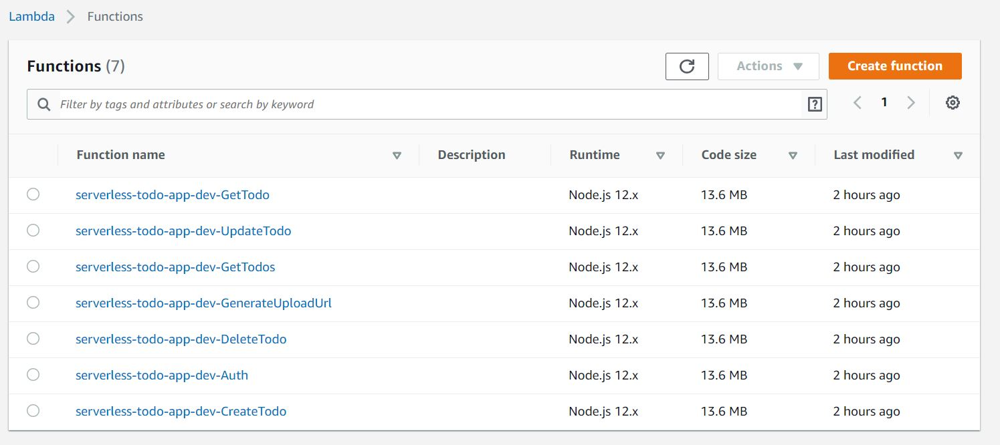
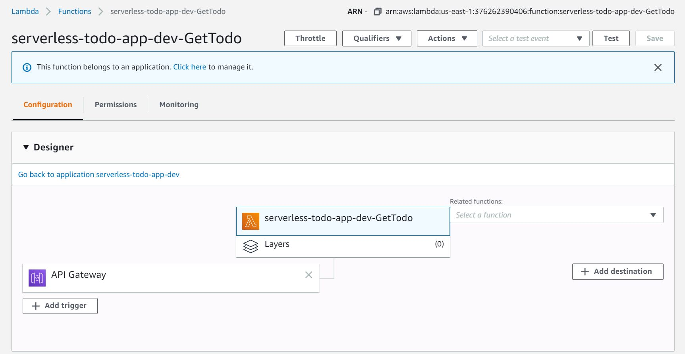
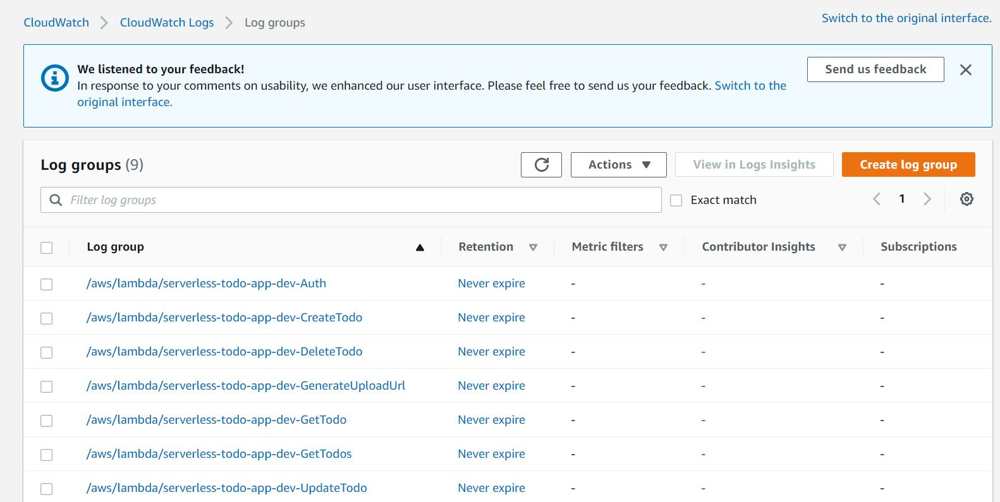
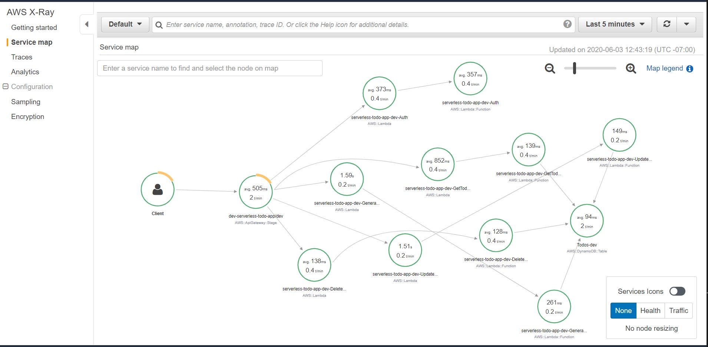

# Serverless TODO

This project is part of the Cloud Developer Nanodegree. The goal of this project to implement a simple TODO application using AWS Lambda and Serverless framework.


## Functionality of the application

This application allows to create/remove/update/fetch TODO items. Each TODO item can optionally have an attachment image. Each user only has access to TODO items that he/she has created.

## TODO items

The application store TODO items, and each TODO item contains the following fields:

* `todoId` (string) - a unique id for an item
* `userId` (string) - the user id that created this todo item
* `createdAt` (string) - date and time when an item was created
* `name` (string) - name of a TODO item (e.g. "Change a light bulb")
* `dueDate` (string) - date and time by which an item should be completed
* `done` (boolean) - true if an item was completed, false otherwise
* `attachmentUrl` (string) (optional) - a URL pointing to an image attached to a TODO item


## Functions implemented

To implement this project, the following functions have been configured: 

* `Auth` - this function implement a custom authorizer for API Gateway that should be added to all other functions.

* `GetTodos` - return all TODOs for a current user. A user id can be extracted from a JWT token that is sent by the frontend

It returns data that looks like this:

```json
{
  "items": [
    {
      "todoId": "123",
      "createdAt": "2019-07-27T20:01:45.424Z",
      "name": "Buy milk",
      "dueDate": "2019-07-29T20:01:45.424Z",
      "done": false,
      "attachmentUrl": "http://example.com/image.png"
    },
    {
      "todoId": "456",
      "createdAt": "2019-07-27T20:01:45.424Z",
      "name": "Send a letter",
      "dueDate": "2019-07-29T20:01:45.424Z",
      "done": true,
      "attachmentUrl": "http://example.com/image.png"
    },
  ]
}
```

* `CreateTodo` - create a new TODO for a current user. A shape of data send by a client application to this function can be found in the `CreateTodoRequest.ts` file

It receives a new TODO item to be created in JSON format that looks like this:

```json
{
  "name": "Buy milk",
  "dueDate": "2019-07-29T20:01:45.424Z",
}
```

It returns a new TODO item that looks like this:

```json
{
  "item": {
    "todoId": "123",
    "createdAt": "2019-07-27T20:01:45.424Z",
    "name": "Buy milk",
    "dueDate": "2019-07-29T20:01:45.424Z",
    "done": false,
    "attachmentUrl": "http://example.com/image.png"
  }
}
```

* `UpdateTodo` - update a TODO item created by a current user. A shape of data send by a client application to this function can be found in the `UpdateTodoRequest.ts` file

It receives an object that contains three fields that can be updated in a TODO item:

```json
{
  "name": "Buy bread",
  "dueDate": "2019-07-29T20:01:45.424Z",
  "done": true
}
```

The id of an item that is updated is passed as a URL parameter.

It returns an empty body.

* `DeleteTodo` - should delete a TODO item created by a current user. Expects an id of a TODO item to remove.

It returns an empty body.

* `GenerateUploadUrl` - returns a pre-signed URL that can be used to upload an attachment file for a TODO item.

It returns a JSON object that looks like this:

```json
{
  "uploadUrl": "https://s3-bucket-name.s3.eu-west-2.amazonaws.com/image.png"
}
```

All functions are already connected to appropriate events from API Gateway.

An id of a user can be extracted from a JWT token passed by a client.

The `serverless.yml` file includes all of these functions as well as a DynamoDB table and a S3 bucket in the `resources`.


## Authentication

This app is using Auth0 to implement authentication. The configuration of the "domain" and "client id" are available on the `client/src/config.ts` file.


## How to run the application

### Backend

This application has been deployed to AWS using the following commands: `sls deploy -v`

### Frontend

To have the application running on your local machine, run the following commands:

```
cd client
npm install
npm run start
```

## Accomplishments

### Automic Resource Creation




### Configuration of Lambda Functions





### Implemented Tracing

#### CloudWatch



#### X-Ray

